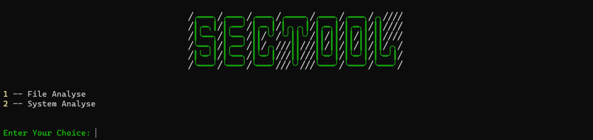

# masc-tool
*Malware Analyse and System Security Tool* is designed to perform security checks on machines with Windows operating system. For it to work, it is enough to have Python (3.10 or later) installed on the machines. It can be run from the command line.
Tool has two different option at first. **Malware Analyse** option can analyse malicious software with `.exe` extension running on the machine. However, it can be detected with which IPs or URLs that malware communicates.
**Security Analyse** is for analyse any `.exe` file on the device and to inform the person using the tool whether the file is harmful or not. With 6 different options, you can query the suspected file via VirusTotal and the results can be returned.

 
||
|---------|
| Main Menu |
 

## To Run Project in Terminal
- ### You should write your own API Key in order to run.
- ### Do not change the folder and file names in python script.
- ### All files will be at C:/Users/{user}/masc.

 

## Malware Analyse
