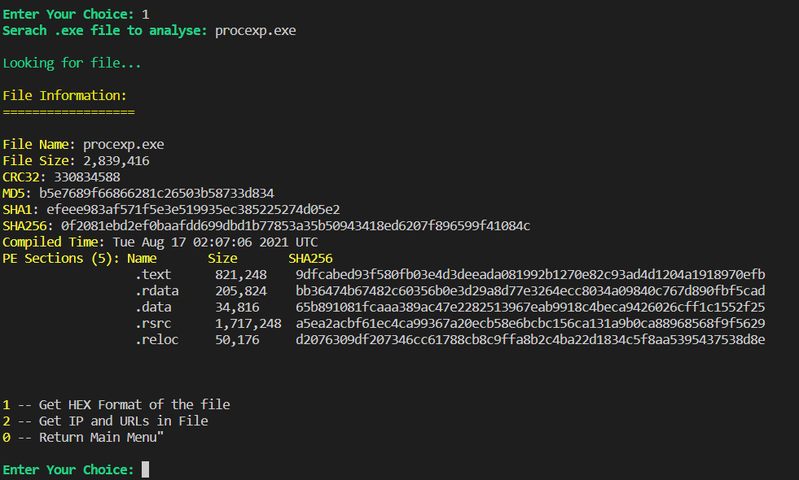
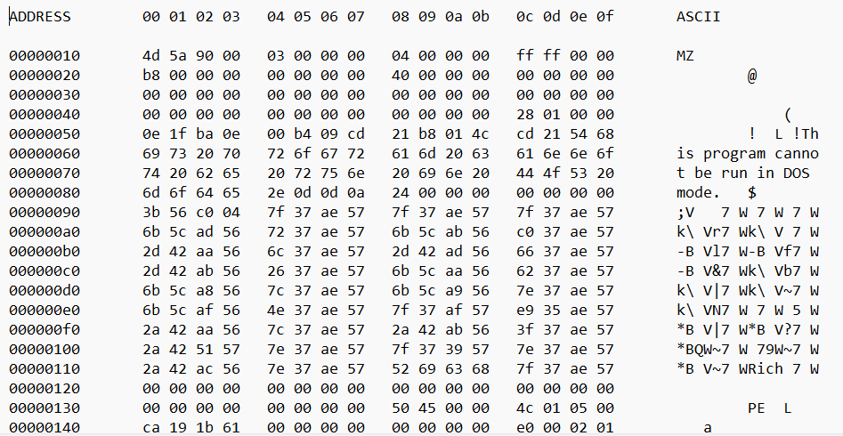
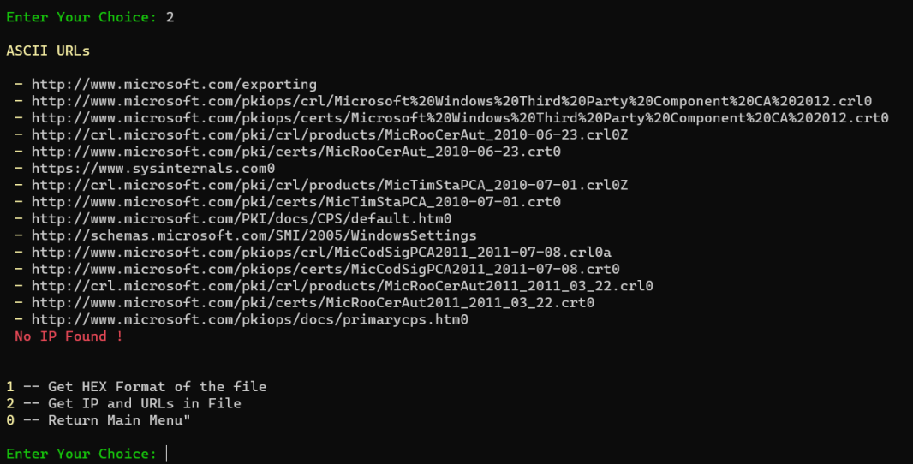
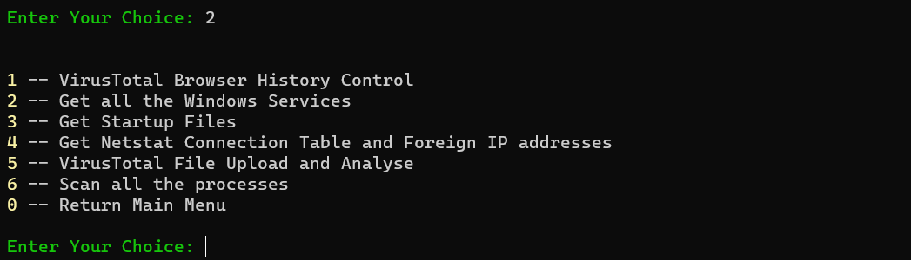
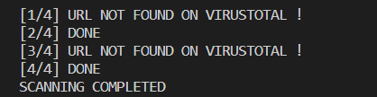
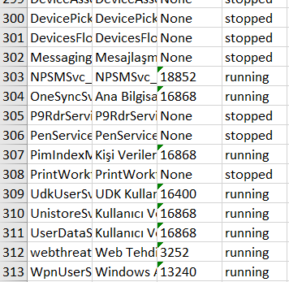
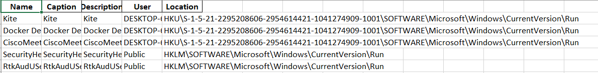
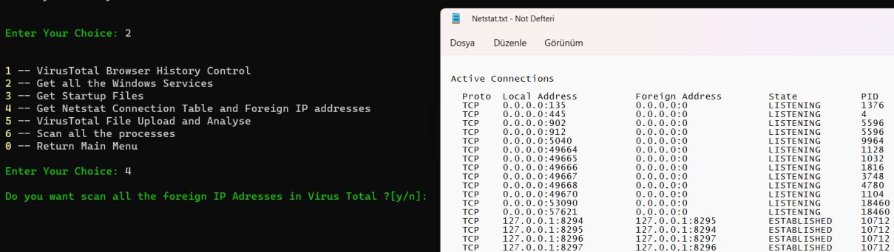

# masc-tool
*Malware Analyse and System Security Tool* is designed to perform security checks on machines with Windows operating system. For it to work, it is enough to have Python (3.10 or later) installed on the machines. It can be run from the command line.
Tool has two different option at first. **Malware Analyse** option can analyse malicious software with `.exe` extension running on the machine. However, it can be detected with which IPs or URLs that malware communicates.
**Security Analyse** is for analyse any `.exe` file on the device and to inform the person using the tool whether the file is harmful or not. With 6 different options, you can query the suspected file via VirusTotal and the results can be returned.

|  |
|-----------------------------------|
| **Main Menu**                     |

 

## To Run Project in Terminal
- ### You should write your own API Key in order to run.
- ### Do not change the folder and file names in python script.
- ### All files will be at C:/Users/{user}/masc.

 

## Malware Analyse

The **Malware Analyse** option is used to scan a suspected file on the machine. It saves the file in _HEX_ format or outputs the IP and URLs in the file to make it easier for the analysts. Outputs the file information of the file whose name is entered.

|  |
|-----------------------------------------|
| **Malware Analysis**                    |             
 

1. #### Formatting file to HEX
In this option, the file name to be converted to **HEX** format is taken as input. The file name is searched in the C folder . It'll check if this file exists in C.
In the next step, the obtained file is read in binary format. Then it is grouped as **HEX** and **ASCII** together with the functions in the image. The user is then asked if the file is ready and if they want to open it.
 

|    |
|------------------------------------|
| **Output: HEX format of the file** | 
 

2. #### Listing IPs and URLs on the file

In this option, the **IPs** and **URLs** in the selected file are listed. For this listing, the IPs and URLs that the file communicates with are revealed as a result of a regex-based search.

|        |
|--------------------------------------|
| **Output: IPs and URLs in the file** | 

 

## System Analyse

With the system analyse option, `.exe` files on the device can be queried on **VirusTotal** and the IP addresses that the device connects to can be examined.

|  |
|----------------------------------------|
| **System Analyse**                     | 

 

1. #### Browser History Control

    With this option, the history of the **default browser** on the device is obtained. With the help of the API over VirusTotal, it is questioned whether the requested URLs are harmful.
    
    |  |
    |----------------------------------------|
    | **Browser History**                     | 

 

2. #### Checking all Windows Services

    This option lists **all services** running on the device. In this way, any service that could threaten the security of the device is checked. Services are downloaded with the help of _Psutil_ library.

    |  |
    |----------------------------------------|
    | **Windows Services**                   | 

 

3. #### Get Startup Files

    It gives a list of files that start when the device is started. Malware can be contained in the startup files which runs when device starts up. Viewing these files can help to identify if malicious software is present.
    
    |  |
    |----------------------------------------|
    | **Startups**                            | 

 

4. #### Netstat Connection Table and Foreign IP addresses
    
    With this option, the **Netstat** connection table of the device is saved in a .txt file and external **IP** addresses can be examined. All of the connected IP addresses and which processes they are running can be seen. **Foreign IPs** can be queried via **_VirusTotal_**.

    |  |
    |----------------------------------------|
    | **Netstat Table and Foreign IP Addresses**              | 

 

5. #### VirusTotal File Upload and Analyse

6. #### Scan All the Process 